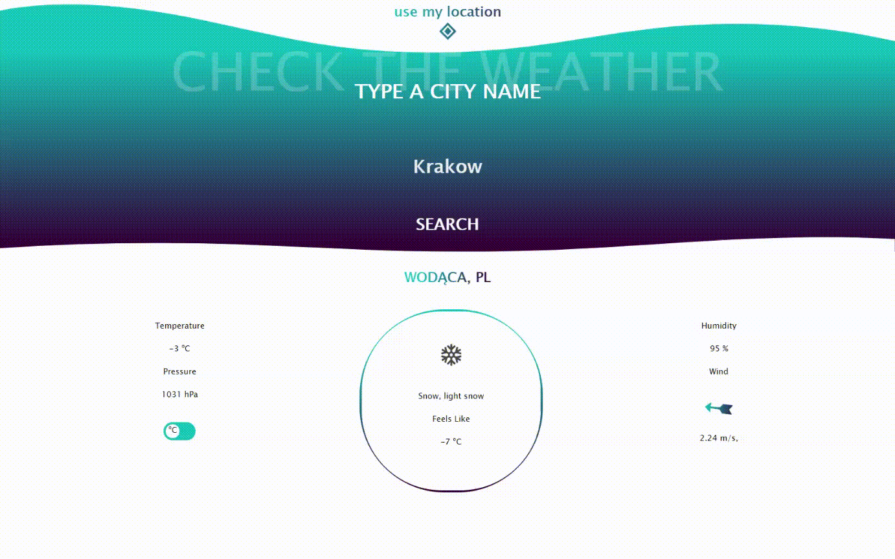

# WeatherApp

Hey! [Let's check the weather in your area!](https://wblachut.github.io/WeatherApp_TheOdinProject/)!

#

## PROJECT: WEATHER APP

Project is a part of The Odin Project [JavaScript learning curriculum](https://www.theodinproject.com/courses/javascript). To learn more open the [assignment](https://www.theodinproject.com/courses/javascript/lessons/weather-app).

## Description

Weather web application that allows you to check th weather in your area and in other cities by external API. You can change temperature display units by toggling `switch` in the left part of weather display window. This page script uses fetch to get weather information for typed city name. **Highly recommended to add country abbreviations!**. External API source: [OpenWeatherMap](https://openweathermap.org/current).

## Concepts used and learned:

- APIs
- Async/await
- Javascript Promises
- Fetching Data
- CSS Transitions

# Tools:

- Visual Studio Code
- Javascript
- Webpack
- ESLint
- Prettier
- OpenWeatherMap API

## Some concepts to apply in future and possible upgrades:

- upgrade animations display
- fix project responsiveness
- add crazy animations for certain types of weather
